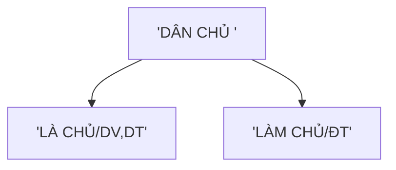

ĐẠI HỘI vii của Đảng là "Đại hội của trí tuệ đổi mới , dân chủ kỷ cương doan kết" hoạch định con người quá dộ lên chủ nghĩa xã hội phù hợp với đặc điểm cua việt nam 

đồng chí đỗ 10 làm tổng bí thư 

sinh vien 